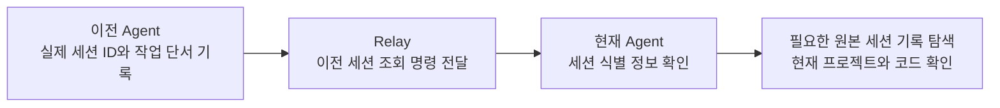

# Relay

**다음 Agent가 이전 세션을 스스로 찾아갈 수 있도록, 세션의 식별 정보와 짧은 작업 단서를 연결하는 로컬 도구입니다.**

Codex로 작업하다가 Claude Code나 Grok으로 옮기거나 새 대화를 시작하면, 새 Agent는 어떤 세션에서 무슨 일을 했는지부터 찾아야 합니다. Relay는 실제 세션 ID, 제공자와 도구, 프로젝트 경로, 최근 작업의 짧은 요약을 기록해 그 탐색의 출발점을 제공합니다.

현재 Agent는 Relay에서 이전 작업을 식별한 뒤, 필요하면 해당 도구의 로컬 세션 저장 위치를 찾아 원본 기록을 읽고 프로젝트 파일과 Git 상태를 확인합니다. **Relay는 찾을 단서를 전달하고, 내용을 파악하는 일은 Agent가 수행합니다.** 요약에 이전 대화를 자세히 옮겨 적을 필요는 없습니다.



Relay가 저장하는 프로젝트 경로는 작업 디렉터리입니다. 원본 대화 파일의 경로를 저장하거나 자동으로 찾아주는 기능은 없습니다. 원본 기록의 위치는 도구·호스트·설정에 따라 달라지며, 현재 Agent가 접근 가능한 환경에서 확인해야 합니다. 원본 기록을 읽을 수 없다면 조회한 단서와 실제 소스를 바탕으로 확인 가능한 범위를 구분합니다.

기록은 로컬 SQLite에 저장하고 CLI와 브라우저에서 조회합니다. 전체 대화 보관, 원본 로그 수집, 실행 중인 Agent 전환, 기존 대화 자동 재개는 제공하지 않습니다.

[사용 흐름](#이전-세션을-전달하는-방법) · [설치](#설치와-실행--windows) · [자동 기록용 프롬프트](#자동-기록용-4줄-프롬프트) · [조회 명령](#조회-명령과-식별자) · [30일 보관](#최근-작업을-위한-30일-보관) · [문제 해결](#문제-해결)

## 이전 세션을 전달하는 방법

Relay가 설치되고 이전 세션이 기록돼 있다면, 사용자는 이전 작업의 출처를 고르기만 하면 됩니다.

### 현재 Agent에게 직접 조회 요청하기

예를 들어 Codex에서 다음처럼 요청합니다.

> Relay로 직전 Grok 세션을 찾아서 어떤 작업을 했는지 파악해 주세요. 필요하면 해당 세션의 원본 기록과 현재 소스를 확인해 주세요.

현재 Agent는 다음 명령으로 출발할 수 있습니다.

```powershell
relay latest grok --json
```

여기서 `grok`은 **찾아볼 이전 작업의 출처**입니다. 현재 Agent를 Grok으로 바꾸는 옵션이 아닙니다. 특정 프로젝트의 작업을 찾으려면 범위를 지정합니다.

```powershell
relay latest grok --cwd "C:\workspace\my-project" --json
```

조회 결과에서 주로 쓰는 단서는 다음과 같습니다.


| 정보                        | Agent가 확인하는 것                       |
| ------------------------- | ----------------------------------- |
| `provider` / `agent`      | 어떤 제공자와 도구의 세션인지                    |
| `providerSessionId`       | 원본 세션을 찾을 때 사용할 실제 Agent Session ID |
| `workingDirectory`        | 어느 프로젝트에서 수행한 작업인지                  |
| `sessionName` / `summary` | 어떤 작업을 하던 세션인지                      |
| `createdAt` / `updatedAt` | Relay에 처음 기록하고 마지막으로 갱신한 시점         |


`summary`는 이 세션이 찾던 작업인지 판단하는 짧은 단서입니다. 상세한 판단 근거나 변경 내용이 필요하면 Agent가 추가로 조사합니다. `show --history`로 확인하는 것은 **Relay에 남긴 요약의 이력**이며, 원본 대화 전체가 아닙니다.

### 직접 골라서 다음 대화에 붙여넣기

```powershell
relay --grok
```

터미널에서 표시된 세션을 클릭하거나 `Enter`를 누르면 다음 대화에 붙여넣을 한 줄이 복사됩니다. 여러 기록 중에서 고르려면 `relay list`를 사용하세요. 브라우저의 **세션 컨텍스트 복사**도 같은 방식입니다.

복사 내용의 형태는 다음과 같습니다. 꺾쇠 안에는 선택한 기록의 실제 값이 들어갑니다.

```text
이전 세션 맥락은 `relay show '<Agent Session ID>' --provider '<provider>' --data-dir '<Relay 저장소>' --json` 명령을 실행해 확인하고, 그 기록을 참고해 다음 작업에 참고 해주세요.
```

현재 Agent가 이 조회 명령을 실행하면 세션을 찾을 단서를 얻습니다. 명령에 저장소 경로까지 포함하므로 다른 Relay 저장소의 기록과 혼동하는 것을 줄입니다. 줄바꿈 없는 한 줄을 사용해 CLI 입력창에서 붙여넣기 도중 대화가 먼저 전송되는 문제를 줄입니다.

받는 Agent는 `relay`를 실행하고 해당 로컬 저장소에 접근할 수 있어야 합니다. 이 명령 자체가 다른 PC로 세션 기록을 전송하지는 않습니다. 저장소 경로를 확인하지 못한 경우 복사 명령은 `--data-dir`을 생략하므로, 받는 환경의 기본 저장소를 조회하게 됩니다.

이전 작업을 **파악하는 요청**과 **이어서 수행하는 요청**은 구분합니다. 실제 작업을 재개하려면 “이 기록을 확인하고 작업을 이어서 해 주세요”처럼 요청하고, Agent는 현재 소스를 확인한 뒤 `relay continue`로 세션의 출처를 연결합니다.

## 설치와 실행 · Windows

Windows 10/11 x64용 실행 파일은 `dist/relay.exe`입니다. 실행 파일에 런타임과 웹 자산이 포함되므로 설치 후 사용하는 데 Node.js나 Bun, 관리자 권한이 필요하지 않습니다.

### 빌드하고 설치하기

소스에서 빌드할 때는 Node.js 22.12 이상과 npm이 필요합니다. 이 저장소 폴더에서 실행하세요. 필요한 개발 의존성은 프로젝트 내부에 설치됩니다.

```powershell
npm ci
npm run build
.\scripts\install-cli.ps1
```

이미 빌드된 `dist/relay.exe`를 받았다면 설치 스크립트만 실행하면 됩니다. 스크립트는 실행 파일을 `%USERPROFILE%\.local\bin\relay.exe`에 복사하고, 해당 폴더를 사용자 PATH에 추가한 뒤 `relay install-hooks`로 Claude·Grok·Codex SessionStart 훅을 등록합니다. `Installed:`가 표시되면 새 터미널에서 확인하세요.

```powershell
relay --version
relay --help
```

설치 없이 실행 파일을 직접 사용해도 됩니다.

```powershell
.\dist\relay.exe --help
.\dist\relay.exe latest grok --json
```

`relay.exe`를 실행하면 빠진 SessionStart 훅을 다시 등록합니다. `relay hook`은 세션 시작 경로라서 등록을 건너뜁니다. Codex는 등록 후 `/hooks`에서 한 번 신뢰해야 실행됩니다. 작업 요약은 이후 Agent가 `update`로 남깁니다. 프로젝트에는 [스킬과 기록 지침](#agent-스킬과-자동-기록)을 적용하세요.

### 브라우저 열기

```powershell
relay web --open
```

기본 주소는 `http://127.0.0.1:7474`입니다. `--open`을 생략하면 서버만 시작하며, 종료는 해당 터미널에서 `Ctrl+C`입니다. CLI 기록·조회는 웹 서버 없이도 동작합니다.

### 업데이트와 제거

교체할 실행 파일을 사용하는 `relay web` 서버가 있다면 먼저 종료하세요. 빌드와 설치 스크립트는 서버를 자동 종료하지 않습니다.

```powershell
npm run build
.\scripts\install-cli.ps1 -Force
```

설치 후 웹 서버를 다시 실행하면 새 버전을 사용합니다. `-Force` 없이 다른 실행 파일을 덮어쓰려 하면 설치를 중단하고, 같은 파일을 다시 설치하면 그대로 둡니다. 설치 위치는 `-InstallDirectory <절대경로>`, PATH 등록 생략은 `-NoPath`로 지정합니다.

제거하려면 실행 중인 Relay를 종료하고 설치된 `relay.exe`를 삭제하세요. 데이터도 지우려면 [실제로 사용한 저장소](#데이터-위치와-설정)를 확인한 뒤 삭제합니다. 저장소 삭제는 되돌릴 수 없습니다. `.local\bin`에는 다른 프로그램도 있을 수 있으므로 폴더 전체를 지우지 마세요.

## Agent 스킬과 자동 기록

배포 원본은 [skills/relay-session](skills/relay-session/SKILL.md)입니다. 스킬은 현재 Agent가 Relay를 기록·조회하는 절차를 제공합니다. 프로젝트 단위로 설치하며, 기존 파일의 내용이 다르면 덮어쓰지 않고 중단합니다.

이 저장소에서 아래 명령을 실행하되, 경로는 Relay를 사용할 실제 프로젝트로 바꾸세요.

```powershell
.\scripts\install-skill.ps1 -Agent codex -ProjectDirectory "C:\workspace\my-project"
.\scripts\install-skill.ps1 -Agent claude -ProjectDirectory "C:\workspace\my-project"
```

설치 스크립트의 대상은 `codex`와 `claude`이며, 각각 `.agents/skills/relay-session`과 `.claude/skills/relay-session`에 배치합니다. 전역 설정이나 PATH는 변경하지 않습니다. 설치 후 스킬이 목록에 보이지 않으면 Agent 세션을 다시 열어 확인하세요. 호출 방식은 호스트에 따라 다를 수 있으므로, 인식되지 않는 환경에서는 현재 Agent에게 `relay latest <별칭> --json` 실행을 요청할 수 있습니다.

예를 들어 스킬을 인식한 Codex 환경에서는 `$relay-session grok`으로 Grok 기록을 조회할 수 있습니다. 조회만 요청했으면 이를 작업 재개로 간주하지 않습니다. 실제 세션 ID 제공 여부와 스킬의 자동 수행 여부는 호스트마다 확인해야 합니다.

### 자동 기록용 4줄 프롬프트

`relay`와 `relay-session` 스킬을 사용할 수 있는 환경에서, 아래 네 줄을 프로젝트의 `AGENTS.md` 또는 `CLAUDE.md`에 그대로 추가하세요. 스킬에 트리거가 있더라도 **첫 작업 전에 기록 절차를 수행하도록** 명시하는 용도입니다.

```text
세션의 첫 작업 전에 relay-session 스킬을 읽고, 그 절차에 따라 현재 세션 정보를 Relay에 기록한다.
명령을 추측하지 않는다. 스킬을 찾지 못하면 relay --help로 확인한다.
호스트가 제공한 실제 세션 ID만 사용하고, 기존 기록을 먼저 확인해 없을 때만 생성한다.
이전 작업을 이어받으면 continue로 출처를 연결하고, 작업 단위가 끝나면 짧은 진행 단서를 갱신한다.
relay가 없거나 기록에 실패하면 한 줄로 알리고 원래 작업을 계속한다.
```

이 프롬프트는 Agent가 수행할 지침이며 강제 실행 훅은 아닙니다. `record` 중복 호출, 임의 ID 생성, 긴 대화 복사를 요구하지 않습니다. PowerShell에서는 호스트가 제공하는 환경변수를 `$env:CODEX_THREAD_ID`, `$env:CLAUDE_CODE_SESSION_ID`, `$env:GROK_SESSION_ID` 형태로 전달합니다. 변수가 제공되지 않는 환경은 스킬의 실제 ID 확인 절차를 따릅니다.

### 시작 훅으로 첫 기록 남기기

`relay hook <codex|claude|grok>`은 호스트가 전달하는 JSON을 stdin으로 받아 첫 기록을 만듭니다. `relay.exe` 실행과 `relay install-hooks`가 Claude·Grok·Codex SessionStart 훅을 등록합니다. 기존 훅은 유지하고, Relay 항목이 이미 있으면 실행 파일 경로만 맞춥니다. 수동으로 넣을 때의 위치는 다음과 같습니다.

Claude Code는 사용자 설정의 `hooks.SessionStart`에 기존 항목을 보존하며 추가합니다.

```json
{
  "hooks": {
    "SessionStart": [
      { "hooks": [{ "type": "command", "command": "\"C:/Users/<사용자>/.local/bin/relay.exe\" hook claude || echo {}", "timeout": 10 }] }
    ]
  }
}
```

Grok은 `~/.grok/hooks/relay.json`에 둡니다. Windows에서는 `relay.exe`가 같은 폴더에 만드는 `relay-hook-grok.cmd`를 사용합니다.

```json
{
  "hooks": {
    "SessionStart": [
      { "hooks": [{ "type": "command", "command": "C:/Users/<사용자>/.local/bin/relay-hook-grok.cmd", "timeout": 10 }] }
    ]
  }
}
```

Codex는 `~/.codex/hooks.json`에 둡니다. 등록 후 Codex에서 `/hooks`로 해당 항목을 신뢰해야 실행됩니다.

```json
{
  "hooks": {
    "SessionStart": [
      { "hooks": [{ "type": "command", "command": "C:/Users/<사용자>/.local/bin/relay-hook-codex.cmd", "timeout": 10 }] }
    ]
  }
}
```

훅은 `{}`를 먼저 출력하고, 기록 처리 중 오류는 호스트 세션에 전파하지 않습니다. CLI 부재 시에는 예시의 `|| echo {}` 또는 hook 래퍼가 대체 출력을 제공합니다. 훅 등록과 제한 시간은 사용하는 호스트에서 설정해야 합니다.

- 세션 ID는 페이로드의 `session_id`, `sessionId`, `thread_id` 순서로 확인하고, 없으면 `CLAUDE_CODE_SESSION_ID`, `CODEX_THREAD_ID`, `GROK_SESSION_ID` 환경변수를 확인합니다. 유효한 값이 없으면 기록하지 않습니다.
- 작업 폴더 이름과 `세션 첫 기록 (훅 자동 기록)`이라는 요약으로 등록합니다. 실제 작업 단서는 이후 Agent가 `update`로 남깁니다.
- `agent_id`가 있는 서브에이전트 페이로드는 건너뜁니다. 같은 첫 입력을 다시 받아도 이력을 중복 생성하지 않습니다.

훅은 첫 세션의 식별 정보를 남기는 보조 수단입니다. 그 이후의 작업 판단과 원본 세션 탐색은 현재 Agent가 수행합니다.

## 세션 기록과 연결

기록의 핵심은 **원본 도구가 부여한 실제 세션 ID**입니다. Agent는 호스트가 제공한 값을 그대로 사용하고 임의로 ID를 만들지 않습니다. 이름과 요약에는 다음 Agent가 작업을 식별할 만큼만 짧게 적습니다.

예를 들어 `로그인 리다이렉트 수정. auth/callback.ts 변경, 테스트 통과. 모바일 확인 필요.` 정도면 작업을 찾기 위한 단서가 됩니다. 전체 채팅, 파일 전문, 비밀정보, 내부 추론 과정은 넣지 않습니다. `summary`는 필수이며 최대 4,000자입니다.

### 첫 기록과 갱신

다음은 `CODEX_THREAD_ID`가 제공되는 Codex 환경의 PowerShell 예시입니다. 일반 터미널에서는 이 변수가 없을 수 있습니다. 값이 없으면 도구에서 실제 ID를 확인해야 합니다.

먼저 현재 세션의 기록이 있는지 확인합니다.

```powershell
relay show $env:CODEX_THREAD_ID --provider openai --json
```

기록이 없을 때만 첫 기록을 만듭니다. 저장소 오류 등 다른 실패를 “기록 없음”으로 처리하지 마세요.

```powershell
relay record --provider openai --agent codex --session-id $env:CODEX_THREAD_ID --session-name "로그인 리다이렉트 수정" --summary "로그인 콜백의 리다이렉트 동작 확인 중"
```

기록이 이미 있거나 작업 단위가 끝났으면 요약을 갱신합니다. 시작 훅이 먼저 기록한 경우에도 `update`를 사용합니다.

```powershell
relay update --session-id $env:CODEX_THREAD_ID --provider openai --summary "auth/callback.ts 수정, 테스트 통과. 모바일 확인 필요"
```

`record`에서 `--cwd`를 생략하면 현재 작업 디렉터리를 저장합니다. `--model`은 모델을 확실히 알 때 지정하며, 생략하면 `null`입니다. 동일 provider와 실제 세션 ID로 같은 첫 입력을 재시도해도 이력이 중복 생성되지 않습니다. 반면 `update`는 호출마다 이력을 추가하므로 응답을 잃었다면 자동 재전송하기 전에 `show --history`로 확인하세요.

### 이전 세션의 작업을 이어받기

아래는 Grok 세션을 확인한 Codex가 실제로 작업을 이어받는 예시입니다. `<이전 Agent Session ID>`는 조회 결과의 `providerSessionId`로 바꾸고, 새 세션 ID는 현재 Agent의 실제 값을 사용합니다.

```powershell
relay continue '<이전 Agent Session ID>' --parent-provider xai --provider openai --agent codex --session-id $env:CODEX_THREAD_ID --summary "이전 로그인 수정 세션을 확인함. 현재 소스 기준으로 모바일 동작 검증 진행"
```

`--parent-provider`는 이전 세션의 제공자이고 `--provider`는 현재 세션의 제공자입니다. `continue`는 **Relay 기록 사이의 부모 연결**을 남깁니다. 원본 Agent의 대화를 실행하거나 재개하지 않습니다.

- 작업을 이어받는 경우에는 현재 세션을 별도로 `record`하기보다 `continue`를 먼저 호출합니다. 부모의 종료 상태를 확인할 필요는 없습니다.
- 새 기록은 부모의 작업명과 프로젝트 경로를 기본으로 사용합니다. 다른 작업 폴더에서 이어받으면 `--cwd`를 명시하세요.
- 시작 훅 등으로 현재 세션이 이미 기록돼 있어도 부모가 없으면 연결할 수 있습니다. 이때 만든 시각·도구·작업 경로는 유지되고 `--cwd`는 적용되지 않습니다.
- 같은 부모로 다시 연결하면 추가 변경 없이 반환합니다. 이후의 작업 단서는 `update`로 남깁니다.
- 다른 부모로 연결하거나 자기 자신·자손을 부모로 연결하면 `PARENT_CONFLICT`입니다. 임의로 출처를 바꾸지 않습니다.

## 조회 명령과 식별자


| 명령                                                                | 용도                           |
| ----------------------------------------------------------------- | ---------------------------- |
| `relay latest grok --json`                                        | 모든 프로젝트에서 최근 갱신된 Grok 기록 한 건 |
| `relay --codex` / `--claude` / `--grok`                           | 해당 출처의 최근 기록을 고르는 단축 조회      |
| `relay list --query "로그인" --json`                                 | 작업명·ID·최근 요약·작업 경로의 부분 검색    |
| `relay list --provider openai --agent codex --json`               | 제공자와 도구로 목록 필터링              |
| `relay latest claude --cwd "C:\workspace\my-project" --json`      | 지정한 프로젝트의 최근 Claude 기록       |
| `relay show '<Agent Session ID>' --provider xai --json`           | 실제 ID로 지정한 세션 조회             |
| `relay show '<Agent Session ID>' --provider xai --history --json` | 해당 세션의 Relay 요약 이력까지 조회      |


Agent나 스크립트에서는 `--json`을 사용하세요. 성공 결과는 stdout, 실패 결과는 stderr의 JSON 하나로 출력됩니다. 자동화에서 npm 실행 로그가 섞이지 않도록 `relay` 실행 파일을 직접 호출하세요.

### 출처와 조회 범위


| 조회 별칭    | provider    | agent         |
| -------- | ----------- | ------------- |
| `codex`  | `openai`    | `codex`       |
| `claude` | `anthropic` | `claude-code` |
| `grok`   | `xai`       | `grok`        |


“최근”의 기준은 **Relay의 마지막 갱신 시각(`updatedAt`)**입니다. 원본 도구에서 가장 최근에 생성한 세션과 같다고 보장하지 않습니다. Relay에 기록되지 않은 세션은 조회되지 않습니다.

`latest`와 단축 조회는 기본적으로 모든 프로젝트를 대상으로 합니다. 결과에는 `조회 범위: 전체 프로젝트`가 표시되며, `latest --cwd`를 지정하면 정규화된 절대경로가 표시됩니다. JSON의 `scope.cwd`는 전체 조회일 때 `null`, 프로젝트 조회일 때 경로 문자열입니다. 경로는 정확히 일치하는 기록을 찾으며, 현재 디렉터리의 상위 프로젝트를 자동 추론하지 않습니다.

해당 범위에 기록이 없으면 `SESSION_NOT_FOUND`와 `details.scope`를 반환합니다. 다른 프로젝트나 제공자로 자동 전환하지 않습니다. 단축 옵션은 한 번에 하나만 사용하고 다른 하위 명령과 함께 쓰지 않습니다. 프로젝트를 제한할 때는 `latest <별칭> --cwd <절대경로>`를 사용하세요.

### 두 종류의 ID


| 표시 이름            | JSON 필드             | 쓰임새                                      |
| ---------------- | ------------------- | ---------------------------------------- |
| Agent Session ID | `providerSessionId` | 원본 Agent의 실제 세션 ID. CLI 조회와 원본 세션 탐색에 사용 |
| Relay 내부 ID      | `id`                | Relay 저장소 내부 식별자. 웹 API와 부모·자식 연결에 사용    |


동일한 실제 세션 ID가 여러 제공자에 있으면 `--provider`를 지정해야 합니다. 내부 ID를 CLI에 잘못 입력하면, 일치하는 내부 기록이 있는 경우 올바른 `relay show` 명령을 안내합니다. 안내에는 실제 ID, provider, 현재 Relay 저장소 경로가 들어갑니다. JSON에서는 `error.details.command`와 `error.details.shell`로 확인할 수 있습니다.

이 경우에도 오류 코드는 `SESSION_NOT_FOUND`, 종료 코드는 `3`입니다. 실제 Agent Session ID로 일치하는 기록이 있으면 우선 조회하며, 지정한 provider와 다른 기록을 대신 안내하지 않습니다.

## 터미널과 브라우저에서 고르기

터미널에서 직접 조회하면 행을 선택해 복사할 수 있습니다. 복사하면 선택 화면이 닫히고, 조회 결과는 터미널 스크롤백에 남습니다. 파일로 리디렉션하거나 Agent가 비대화형으로 호출하면 표 또는 JSON만 출력합니다.


| 조작                                          | 동작                         |
| ------------------------------------------- | -------------------------- |
| 마우스 이동                                      | 행 선택                       |
| 클릭 · `Enter` · `Space`                      | 선택한 세션의 조회 안내 한 줄을 복사하고 닫기 |
| `↑` `↓` · `k` `j` · `PgUp` `PgDn` · `g` `G` | 행 이동                       |
| 휠                                           | 스크롤                        |
| `q` · `Esc` · `Ctrl+C`                      | 복사하지 않고 닫기                 |


`RELAY_NO_TUI=1`로 선택 화면을 끌 수 있습니다. 한글 폭을 고려해 표를 정렬하며, 좁은 터미널에서는 부가 열을 숨깁니다. 색상은 `NO_COLOR=1` 또는 `FORCE_COLOR=0`으로 끌 수 있고, JSON에는 색 코드를 넣지 않습니다. 시각은 화면에서 로컬 시간으로, JSON에서 ISO 8601 UTC로 제공합니다.

브라우저는 검색·제공자·도구·프로젝트 경로 필터, 페이지 이동, 세션 상세 조회를 제공합니다. 상세의 **개요 / 기록 이력 / 세션 연결** 탭에서 작업 단서와 연결된 세션을 찾습니다. 검색 조건과 선택한 세션은 URL에 남습니다. 화면은 3초마다 갱신하고, 숨겨진 탭에서는 주기 조회를 멈춥니다.

- **세션 컨텍스트 복사**: 다음 Agent에게 전달할 조회 명령과 안내 문구 한 줄
- **조회 명령 복사**: `relay show ... --json` 명령만 복사
- **세션 식별자 → Agent Session ID만 복사**: 원본 도구의 실제 세션 ID만 복사

웹에서는 PowerShell·Bash에 맞는 인용 방식을 선택할 수 있습니다. 복사 버튼이 명령을 실행하지는 않습니다. Windows 클립보드는 `clip.exe`를 우선 사용하고 실패하면 PowerShell로 전환합니다. 한글이 깨지면 `RELAY_CLIPBOARD=powershell`로 지정하세요. OS 클립보드 도구를 사용할 수 없으면 터미널에 OSC 52 복사를 요청하지만, 터미널이 허용하지 않으면 반영되지 않을 수 있습니다.

## 데이터 위치와 설정

저장소 선택 순서는 `--data-dir` → `RELAY_DATA_DIR` → 사용자 홈의 `.relay`입니다. 해당 폴더에 `relay.db`와 선택적 `config.json`을 둡니다. **Relay 저장소와 프로젝트 작업 디렉터리는 다른 경로**이며, 기록과 조회에는 같은 Relay 저장소를 사용해야 합니다.

```powershell
relay latest grok --data-dir "C:\relay-data" --json
relay web --data-dir "C:\relay-data" --port 7475
```

`config.json` 예시:

```json
{
  "schemaVersion": 1,
  "webHost": "127.0.0.1",
  "webPort": 7474,
  "retentionDays": 30
}
```

포트는 `--port` → 설정 파일 → `7474` 순서로 선택합니다. 잘못된 설정은 오류로 처리합니다. DB는 로컬 디스크에 두세요. 네트워크 드라이브나 클라우드 동기화 폴더의 DB 공유는 지원하지 않습니다. 실행 중인 DB의 `relay.db`만 복사하면 WAL의 최신 변경이 빠질 수 있습니다.

## 최근 작업을 위한 30일 보관

Relay의 기본 보관 기간은 **마지막 갱신으로부터 30일**입니다. 최근 세션을 찾아 작업을 이어가는 용도에 맞춘 기본값입니다. 시간이 지나고 코드가 계속 수정되면 이전 세션의 판단은 현재 소스와 달라질 수 있으므로, 오래된 요약보다 실제 소스와 버전 관리 기록을 기준으로 작업합니다.

기간이 지난 Relay 기록을 정리해도 프로젝트 소스나 원본 Agent의 세션 파일을 삭제하지는 않습니다. Relay가 관리하는 세션 정보와 그 요약 이력만 대상입니다.

- 정리는 `record`, `continue`, `update` 같은 기록 명령의 트랜잭션 안에서 수행합니다. 조회 명령과 웹 서버는 보관 기간에 따른 삭제를 수행하지 않습니다.
- 기준은 `updatedAt`입니다. 갱신한 세션은 보관 기준 시점도 새로 잡힙니다.
- 남아 있는 자식이 참조하는 부모는 함께 보존합니다. 연결 전체가 기한을 넘기면 정리 대상이 됩니다.
- `retentionDays`는 0~3650 정수입니다. 기본값을 바꿔야 하는 경우에만 설정하고, `0`이면 자동 삭제를 끕니다.

## 문제 해결


| 증상                              | 확인할 것                                                                                      |
| ------------------------------- | ------------------------------------------------------------------------------------------ |
| `relay`를 찾지 못함                  | 설치 후 새 터미널을 열거나 실행 파일의 절대경로를 사용하세요.                                                        |
| `SESSION_NOT_FOUND`             | 출처·조회 범위·저장소를 확인하세요. 내부 ID를 입력했다면 안내된 조회 명령을 사용하세요. Relay에 없다는 뜻이지 원본 세션이 없다는 뜻은 아닙니다.     |
| 엉뚱한 프로젝트의 최근 기록이 나옴             | 기본값은 전체 프로젝트입니다. `latest <별칭> --cwd <프로젝트 절대경로>`로 제한하세요.                                   |
| 세션은 있지만 작업 단서가 비어 있거나 시작 훅 문구뿐임 | Agent가 실제 작업을 시작한 뒤 `update`로 짧은 단서를 남겼는지 확인하세요.                                           |
| 자세한 작업 내용이 필요함                  | 실제 세션 ID와 도구 정보를 바탕으로 접근 가능한 원본 기록을 찾고 현재 소스를 확인하세요. `show --history`는 Relay 요약 이력만 제공합니다. |
| 오래된 Relay 기록이 사라짐               | 기본 30일 보관 정책을 확인하세요. 원본 Agent 기록과 프로젝트 파일은 별개입니다.                                          |
| 설치 시 다른 프로세스에서 사용 중             | 해당 실행 파일을 사용하는 Relay 웹 서버를 종료하고 다시 설치하세요.                                                  |
| 웹 포트가 이미 사용 중                   | `relay web --port 7475`처럼 다른 포트를 지정하세요.                                                    |
| 스킬 설치 시 기존 파일과 다름               | 기존 사용자 지침과 새 원본을 비교한 뒤 수동으로 반영하세요. 설치 스크립트는 다른 내용을 덮어쓰지 않습니다.                              |
| 스크립트 실행 정책으로 차단됨                | 정책을 우회하지 말고 실행 파일을 직접 사용하거나 관리자에게 문의하세요.                                                   |


## API와 데이터 계약

웹 서버는 로컬 조회용입니다. `127.0.0.1`에 바인딩하며 Host/Origin 검사, CSP, SQL 파라미터 바인딩, 텍스트 렌더링을 적용합니다. HTTP 쓰기 API, 임의 파일 다운로드, 셸 실행 기능은 없습니다. 같은 PC의 다른 프로세스를 격리하는 사용자 인증 수단은 아닙니다.


| 조회 API                              | 용도                                      |
| ----------------------------------- | --------------------------------------- |
| `GET /api/v1/health`                | 버전·준비 상태·Relay 저장소 경로                   |
| `GET /api/v1/sessions`              | 목록: `q/provider/agent/cwd/limit/offset` |
| `GET /api/v1/sessions/:id`          | 상세·부모·자식 첫 페이지                          |
| `GET /api/v1/sessions/:id/updates`  | Relay 요약 이력: `limit/offset`             |
| `GET /api/v1/sessions/:id/children` | 자식 세션: `limit/offset`                   |


API의 `:id`는 **Relay 내부 ID**입니다. CLI의 실제 Agent Session ID와 구분하세요. API·CLI는 `schemaVersion: 1`과 camelCase 필드를 사용합니다. 페이지 크기는 기본 50, 최대 100이며 `offset`으로 이동합니다. 목록은 `updatedAt DESC, id DESC`, 요약 이력은 `sequence DESC`입니다.

CLI 종료 코드는 `0` 성공, `2` 입력·설정 오류, `3` 기록 없음, `4` 충돌, `5` 저장소 오류, `6` 서버 시작 실패입니다. 기존 JSON 필드 `providerSessionId`와 `id`는 화면의 식별자 명칭과 별개로 유지합니다.

기존 DB 스키마 v1은 처음 열 때 v2로 자동 전환됩니다. 세션 ID·요약·부모 연결·모델·이력을 보존하고 `started_at`을 `created_at`으로 옮기며, 실행 상태와 종료 시각은 제거합니다. 전환 실패 시 기존 스키마와 기록을 유지합니다. 조회 명령도 필요한 최초 초기화·마이그레이션을 수행한 뒤 읽기 전용 연결을 사용합니다. 구버전에서 올릴 때는 기존 Relay 프로세스를 종료하고 저장소를 백업한 뒤 CLI·웹 실행 파일과 Agent 지침을 함께 갱신하세요. v2 DB는 구버전 실행 파일로 열 수 없습니다.

## 개발과 검증

TypeScript와 Bun으로 구현하고, SQLite에 기록을 저장합니다. 웹은 React·shadcn 기반이며 TanStack Query가 조회 캐시를, Zustand가 UI 상태를 관리합니다. 의존성 버전은 [package.json](package.json)과 잠금 파일을 기준으로 합니다.

```powershell
npm ci
npx playwright install chromium
npm run check
```

`npm run check`는 타입 검사 → CLI·저장소 등 자동 테스트 → 실행 파일 빌드 → Playwright 브라우저 테스트 순서로 실행합니다. 개별 실행은 `npm run typecheck`, `npm test`, `npm run build`, `npm run test:web`입니다.

`npm ci`의 prepare 단계와 `npm run build:web`는 웹 자산을 `src/web/generated/`에 생성합니다. 생성 자산은 Git에 저장하지 않으며, `npm run build`는 웹 자산을 빌드해 실행 파일에 포함합니다. 개발 중 CLI 실행은 `npm run relay -- --help`를 사용할 수 있습니다.

테스트는 별도 임시 저장소를 사용합니다. Playwright는 빌드된 실행 파일을 소스 밖 임시 폴더에서 실행하므로 코드 변경 후에는 먼저 빌드하세요. 터미널 선택 화면의 자동 테스트는 가짜 입출력을 사용하며, 실제 터미널·클립보드 동작은 사용 환경에서 별도로 확인해야 합니다.

현재 검증 대상은 Windows입니다. Linux/macOS용 소스 실행·빌드 경로는 있으나 지원 확정 대상으로 표기하지 않습니다. Agent 호스트의 실제 스킬 수행과 원본 세션 기록 접근도 해당 환경에서 확인해야 합니다.

## 라이선스

[MIT](LICENSE)