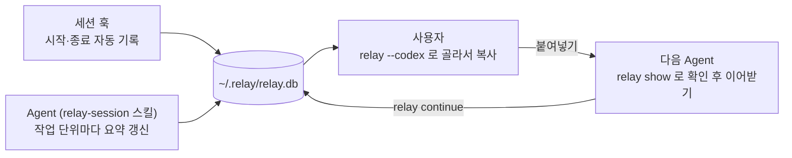

# Relay

**AI Agent 세션이 끝나도 다음 Agent가 이전 작업을 찾아갈 수 있게, 세션 기록을 남기고 연결하는 Windows용 로컬 CLI입니다.**

Claude Code, Codex, Grok을 오가며 작업하면 새로 연 Agent는 이전 세션이 어디서 무엇을 했는지 알 수 없습니다. Relay는 각 세션의 **실제 세션 ID, 사용한 도구, 프로젝트 경로, 짧은 작업 요약**을 로컬 SQLite에 남기고, 그 기록을 다음 Agent에게 한 줄 명령으로 넘겨줍니다.

## 목차

- [Relay가 해결하는 문제](#relay가-해결하는-문제)
- [동작 원리](#동작-원리)
- [용어](#용어)
- [설치](#설치)
- [10분 사용해 보기](#10분-사용해-보기)
- [Agent 연동](#agent-연동)
- [명령 참조](#명령-참조)
- [터미널과 브라우저 화면](#터미널과-브라우저-화면)
- [데이터와 설정](#데이터와-설정)
- [문제 해결](#문제-해결)
- [API](#api)
- [개발](#개발)
- [라이선스](#라이선스)

## Relay가 해결하는 문제

이런 상황을 생각해 보세요.

1. 오후에 Codex로 로그인 버그를 고치다가 세션을 닫았습니다.
2. 저녁에 Claude Code를 열었습니다. 새 Agent는 오후에 어떤 세션에서, 어떤 폴더에서, 어디까지 했는지 모릅니다.
3. 사용자가 기억을 더듬어 설명하거나, 이전 도구의 세션 목록을 뒤져야 합니다.

Relay를 쓰면 세션이 시작될 때 훅이 자동으로 기록을 만들고, Agent가 작업 단위마다 짧은 요약을 남깁니다. 저녁에는 `relay --codex` 한 줄로 오후 세션을 찾아 조회 명령을 복사하고, 새 Agent에게 붙여넣으면 됩니다. Agent는 그 기록을 읽은 뒤 실제 프로젝트 파일을 확인해 작업을 이어갑니다.

기록 한 건은 이렇게 생겼습니다.

| 항목 | 예시 | 뜻 |
| --- | --- | --- |
| provider / agent | `openai` / `codex` | 어느 회사의 어떤 도구로 한 세션인지 |
| Agent Session ID | `0199c2a4-5d8e-7f01-9b3c-2e4f6a8b0c1d` | 원본 도구가 발급한 실제 세션 ID |
| 세션 이름 | `로그인 리다이렉트 수정` | 무슨 작업이었는지 |
| 작업 경로 | `C:\workspace\my-project` | 어느 프로젝트에서 했는지 |
| 최근 요약 | `auth/callback.ts 수정, 테스트 통과. 모바일 확인 필요` | 다음 Agent가 알아야 할 마지막 상태 |
| 생성 · 갱신 · 종료 | `26.09.18 09:25` | 언제 시작했고 마지막으로 갱신했으며 언제 끝났는지 |
| 이전 세션 | Grok 세션 `9f1c…` | 어느 세션을 이어받았는지 |

### Relay가 하지 않는 일

Relay는 **찾아갈 단서**만 남깁니다. 다음은 범위 밖입니다.

- 전체 대화나 원본 로그 보관. 요약은 Agent가 쓴 몇 줄이 전부입니다.
- 실행 중인 Agent 전환이나 대화 자동 재개. 다음 Agent는 기록을 읽고 프로젝트 파일을 직접 확인합니다.
- 여러 PC 간 동기화. 저장소는 로컬 디스크의 SQLite 파일 하나입니다.

## 동작 원리

세 주체가 역할을 나눕니다.



1. **훅이 자동으로 기록합니다.** Claude Code, Codex, Grok의 SessionStart 훅이 세션 시작 시 세션 ID와 작업 폴더를 등록하고, SessionEnd 훅이 종료 시각과 사유를 남깁니다. 설치 시 자동 등록됩니다.
2. **Agent가 요약을 갱신합니다.** 프로젝트에 설치한 `relay-session` 스킬과 `AGENTS.md` 지침에 따라, Agent는 의미 있는 작업 단위가 끝날 때마다 `relay update`로 다음 대화에 필요한 사실을 남깁니다. 훅이 없어도 Agent가 직접 첫 기록을 만듭니다.
3. **사용자가 골라서 넘깁니다.** 터미널 선택 화면이나 브라우저에서 세션을 고르면 조회 명령 한 줄이 복사됩니다. 새 Agent에게 붙여넣으면 그 Agent가 기록을 읽고, 이어받을 때는 `relay continue`로 두 세션을 부모·자식으로 연결합니다.

아무 요약도 남기지 않고 끝난 세션은 훅 자동 기록만 남아 목록만 차지하므로, 종료 훅이 자동으로 지웁니다.

## 용어

| 용어 | 설명 |
| --- | --- |
| **Agent Session ID** | Claude Code, Codex, Grok이 각자 발급하는 36자 UUID입니다. Relay는 이 값을 그대로 저장하고, CLI 조회와 원본 세션 탐색에 씁니다. JSON 필드는 `providerSessionId`입니다. |
| **Relay 내부 ID** | `ses_`로 시작하는 Relay 저장소 식별자입니다. 웹 API와 부모·자식 연결에만 쓰고, CLI 조회에는 쓰지 않습니다. JSON 필드는 `id`입니다. |
| **provider / agent** | 회사 식별자와 도구 식별자입니다. `openai`/`codex`, `anthropic`/`claude-code`, `xai`/`grok`. |
| **출처 별칭** | `codex`, `claude`, `grok`. `relay latest`와 `--codex` 같은 단축 조회에서 provider와 agent 쌍을 한 단어로 가리킵니다. 조회할 **이전 작업의 출처**이지 현재 Agent를 바꾸는 옵션이 아닙니다. |
| **훅 자동 기록** | 시작 훅이 만든 첫 기록입니다. 세션 이름은 작업 폴더명, 요약은 `세션 첫 기록 (훅 자동 기록)`입니다. 실제 단서는 Agent가 `update`로 채웁니다. |
| **세션 연결** | `continue`가 남기는 부모·자식 관계입니다. 이전 세션이 부모, 이어받은 세션이 자식입니다. |
| **종료 기록** | 종료 훅이 남기는 `endedAt`과 `endReason`입니다. 없으면 화면에 `진행 중`으로 보이지만, 강제 종료된 세션도 훅이 돌지 않아 `진행 중`으로 남을 수 있습니다. |

## 설치

Windows 10/11 x64를 지원합니다. `relay.exe` 하나에 런타임과 웹 화면이 모두 들어 있어 설치 후에는 Node.js, Bun, 관리자 권한이 필요 없습니다.

### 빌드하고 설치하기

소스에서 빌드하려면 Node.js 22.12 이상과 npm이 필요합니다. Bun은 npm 의존성으로 함께 설치됩니다.

```powershell
npm ci
npm run build
.\scripts\install-cli.ps1
```

설치 스크립트는 다음을 수행합니다.

1. `dist\relay.exe`를 `%USERPROFILE%\.local\bin\relay.exe`로 복사합니다.
2. 그 폴더를 사용자 PATH에 추가합니다.
3. `relay install-hooks`를 실행해 Claude Code, Codex, Grok의 SessionStart·SessionEnd 훅을 등록합니다.

설치를 확인합니다.

```powershell
relay --version
relay --help
```

`relay`를 찾지 못하면 새 터미널을 여세요. **Codex는 등록된 훅을 `/hooks`에서 한 번 신뢰해야 실행됩니다.** Claude Code와 Grok은 추가 조작이 필요 없습니다.

### 업데이트와 제거

실행 중인 `relay web` 서버나 터미널 선택 화면이 있으면 먼저 종료한 뒤 다시 빌드하고 덮어씁니다.

```powershell
npm run build
.\scripts\install-cli.ps1 -Force
```

| 스크립트 옵션 | 뜻 |
| --- | --- |
| `-Force` | 이미 설치된 실행 파일이 다를 때 덮어씁니다. |
| `-InstallDirectory <절대경로>` | 설치 폴더를 바꿉니다. |
| `-NoPath` | PATH를 건드리지 않습니다. |

제거하려면 설치된 `relay.exe`와 같은 폴더의 `relay-hook-*.cmd`를 삭제하고, 각 도구의 훅 설정에서 Relay 항목을 지웁니다. 데이터까지 지우려면 [저장소 폴더](#데이터와-설정)를 삭제합니다.

## 10분 사용해 보기

설치 직후 흐름을 끝까지 따라가 봅니다.

### 1. 세션을 열면 자동으로 기록됩니다

Claude Code, Codex, Grok 중 아무 도구나 프로젝트 폴더에서 엽니다. 시작 훅이 세션을 등록합니다. 확인해 봅니다.

```powershell
relay list
```

방금 연 세션이 폴더명을 이름으로, `진행 중` 상태로 보입니다. 요약은 아직 훅 기본 문구입니다.

### 2. Agent가 요약을 남기게 합니다

프로젝트에 스킬과 지침을 넣으면 Agent가 작업 단위마다 요약을 갱신합니다. 설치 방법은 [Agent 연동](#agent-연동)에 있습니다. 직접 남겨 보려면 Codex 환경의 PowerShell에서 이렇게 실행합니다.

```powershell
relay update --session-id $env:CODEX_THREAD_ID --provider openai --summary "로그인 콜백 리다이렉트 수정 중. auth/callback.ts 변경"
```

**요약을 한 번도 남기지 않은 세션은 종료 시 삭제됩니다.** 남길 세션이라면 첫 작업 단위가 끝났을 때 반드시 갱신하세요.

### 3. 다른 도구에서 이전 세션을 찾습니다

세션을 닫고 다른 도구를 엽니다. 이전 세션이 Codex였다면 이렇게 찾습니다.

```powershell
relay --codex
```

가장 최근에 갱신된 Codex 세션의 상세가 열립니다. 여러 세션 중에 고르려면 `relay list`에서 행을 고르세요. 상세에서 `Enter`를 누르면 아래 한 줄이 클립보드에 복사됩니다.

```text
이전 세션 맥락은 `relay show '<Agent Session ID>' --provider '<provider>' --data-dir '<Relay 저장소>' --json` 명령을 실행해 확인하고, 그 기록을 참고해 다음 작업에 참고 해주세요.
```

### 4. 새 Agent에게 붙여넣습니다

복사한 문장을 새 대화에 붙여넣으면 Agent가 `relay show`로 기록을 읽습니다. 작업까지 이어받게 하려면 이렇게 요청하세요.

> 이 기록을 확인하고 작업을 이어서 해 주세요.

Agent는 `relay continue`로 현재 세션을 이전 세션의 자식으로 연결한 뒤, 프로젝트 파일을 확인하고 작업을 계속합니다. **파악만 요청**하면 조회만 하고, **이어서 하라고 요청**해야 연결과 재개를 합니다.

### 5. 흐름을 브라우저에서 확인합니다

```powershell
relay web --open
```

`http://127.0.0.1:7474`에서 세션 목록, 상세, 요약 이력, 부모·자식 연결을 볼 수 있습니다.

## Agent 연동

Agent가 스스로 기록하게 하려면 프로젝트마다 스킬과 지침을 설치합니다. 훅은 설치 시 사용자 단위로 한 번만 등록됩니다.

### 스킬 설치

[skills/relay-session](skills/relay-session/SKILL.md)은 Agent가 Relay를 기록·조회·이어받는 절차를 담은 스킬입니다. 프로젝트 단위로 설치하며, 기존 파일 내용이 다르면 덮어쓰지 않고 중단합니다.

```powershell
.\scripts\install-skill.ps1 -Agent codex -ProjectDirectory "C:\workspace\my-project"
.\scripts\install-skill.ps1 -Agent claude -ProjectDirectory "C:\workspace\my-project"
```

각각 `.agents/skills/relay-session`, `.claude/skills/relay-session`에 배치됩니다. 스킬을 인식한 Codex에서는 `$relay-session grok`, Claude Code에서는 `/relay-session grok`으로 Grok 기록을 조회할 수 있습니다. Grok용 스킬 설치 스크립트는 아직 없으므로 같은 `SKILL.md`를 Grok의 스킬 위치에 직접 두세요.

### 프로젝트 지침

프로젝트의 `AGENTS.md` 또는 `CLAUDE.md`에 아래 지침을 추가하면 Agent가 첫 작업 전에 기록 절차를 수행합니다. 이 저장소의 [AGENTS.md](AGENTS.md)가 실제 예시입니다.

```text
세션의 첫 작업 전에 relay-session 스킬을 읽고, 그 절차에 따라 현재 세션 정보를 Relay에 기록한다.
명령을 추측하지 않는다. 스킬을 찾지 못하면 relay --help로 확인한다.
호스트가 제공한 실제 세션 ID만 사용하고, 기존 기록을 먼저 확인해 없을 때만 생성한다.
이전 작업을 이어받으면 continue로 출처를 연결하고, 작업 단위가 끝나면 짧은 진행 단서를 갱신한다.
update를 한 번도 남기지 않은 세션 기록은 종료 시 삭제되므로 첫 작업 단위가 끝나면 반드시 갱신한다.
relay가 없거나 기록에 실패하면 한 줄로 알리고 원래 작업을 계속한다.
```

세션 ID는 각 도구가 환경변수로 제공합니다. Agent는 이 값을 그대로 쓰고 임의로 만들지 않습니다.

| 도구 | 환경변수 | `--provider` / `--agent` |
| --- | --- | --- |
| Claude Code | `CLAUDE_CODE_SESSION_ID` | `anthropic` / `claude-code` |
| Codex | `CODEX_THREAD_ID` | `openai` / `codex` |
| Grok | `GROK_SESSION_ID` | `xai` / `grok` |

### Agent가 실행하는 명령

Agent가 스킬에 따라 실행하는 세 가지 흐름입니다. Codex 환경의 PowerShell 예시이며, 다른 도구는 환경변수와 provider/agent만 바꾸면 됩니다.

**첫 기록.** 먼저 현재 세션의 기록이 있는지 확인하고, 없을 때만 만듭니다. 훅이 이미 기록해 두었다면 `update`로 넘어갑니다.

```powershell
relay show $env:CODEX_THREAD_ID --provider openai --json
relay record --provider openai --agent codex --session-id $env:CODEX_THREAD_ID --session-name "로그인 리다이렉트 수정" --summary "로그인 콜백의 리다이렉트 동작 확인 중"
```

**요약 갱신.** 작업 단위가 끝날 때마다 실행합니다. 같은 첫 입력으로 `record`를 재시도해도 이력이 중복되지 않지만, `update`는 호출마다 이력을 추가합니다.

```powershell
relay update --session-id $env:CODEX_THREAD_ID --provider openai --summary "auth/callback.ts 수정, 테스트 통과. 모바일 확인 필요"
```

**이어받기.** Grok 세션을 확인한 Codex가 작업을 이어받는 예시입니다. `--parent-provider`는 이전 세션의 제공자, `--provider`는 현재 세션의 제공자입니다.

```powershell
relay continue '<이전 Agent Session ID>' --parent-provider xai --provider openai --agent codex --session-id $env:CODEX_THREAD_ID --summary "이전 로그인 수정 세션을 확인함. 모바일 동작 검증 진행"
```

- 이어받을 때는 별도로 `record`하지 않고 `continue`를 먼저 호출합니다. 훅이 현재 세션을 이미 기록해 두었어도 부모가 없으면 그 기록에 연결됩니다.
- `continue`는 Relay 기록 사이의 연결만 남기며 원본 대화를 재개하지 않습니다.
- 새 기록은 부모의 세션 이름과 프로젝트 경로를 기본으로 씁니다. 다른 폴더에서 이어받으면 `--cwd`를 지정하세요.
- 이미 다른 부모에 연결돼 있거나 자기 자신·자손을 부모로 지정하면 `PARENT_CONFLICT`입니다.

요약은 다음 Agent가 작업을 식별할 만큼만 짧게 씁니다. 목표, 현재 상태, 변경 파일, 검증 결과, 남은 위험이나 다음 작업이면 충분하고, 전체 채팅, 파일 전문, 비밀정보는 넣지 않습니다.

### 시작·종료 훅

`relay install-hooks`가 세 도구의 SessionStart·SessionEnd 훅을 등록합니다. `relay.exe`를 실행할 때마다 빠진 훅을 다시 채우므로 설정을 지웠더라도 다음 실행에서 복구됩니다. 기존의 다른 훅은 유지하고, Relay 항목이 이미 있으면 실행 파일 경로만 맞춥니다.

| 도구 | 훅 위치 | 시작 명령 | 종료 명령 |
| --- | --- | --- | --- |
| Claude Code | 사용자 설정 `hooks.SessionStart` · `hooks.SessionEnd` | `relay.exe hook claude` | `relay.exe hook claude --end` |
| Codex | `~/.codex/hooks.json` (`CODEX_HOME`이 설정돼 있으면 그 폴더에도) | `relay-hook-codex.cmd` | `relay-hook-codex-end.cmd` |
| Grok | `~/.grok/hooks/relay.json` | `relay-hook-grok.cmd` | `relay-hook-grok-end.cmd` |

Claude Code 설정 예시입니다. Codex와 Grok은 같은 구조에 래퍼 `.cmd` 경로를 넣습니다.

```json
{
  "hooks": {
    "SessionStart": [
      { "hooks": [{ "type": "command", "command": "\"C:/Users/<사용자>/.local/bin/relay.exe\" hook claude || echo {}", "timeout": 10 }] }
    ],
    "SessionEnd": [
      { "hooks": [{ "type": "command", "command": "\"C:/Users/<사용자>/.local/bin/relay.exe\" hook claude --end || echo {}", "timeout": 10 }] }
    ]
  }
}
```

훅의 동작 규칙입니다.

- 훅은 `{}`를 먼저 출력하고 기록을 시도하므로, 기록 오류가 도구의 세션을 막지 않습니다.
- 세션 ID는 페이로드의 `session_id`, `sessionId`, `thread_id`, 그다음 환경변수 순으로 찾습니다. 서브에이전트 페이로드(`agent_id`)는 기록하지 않습니다.
- 시작 훅은 작업 폴더 이름과 `세션 첫 기록 (훅 자동 기록)` 요약으로 등록합니다. 같은 세션이 다시 시작돼도 이력이 늘지 않습니다.
- 종료 훅은 종료 시각(`endedAt`)과 도구가 보낸 사유(`endReason`, 예: `prompt_input_exit`, `logout`)를 남깁니다. 마지막 갱신 시각과 요약 이력은 바뀌지 않습니다.
- 이력이 훅 자동 기록 한 건뿐이고 이어받은 세션도 없으면 종료 시 기록을 삭제합니다.
- 같은 세션이 다시 시작되거나 `update`·`continue`가 오면 종료 기록을 지웁니다.
- Codex는 등록된 시작·종료 항목을 `/hooks`에서 각각 신뢰해야 실행됩니다. Orca처럼 `CODEX_HOME`을 따로 두는 호스트에서 실행한 Codex는 그 폴더의 `hooks.json`을 읽으므로, 그 환경변수가 있는 셸에서 `relay install-hooks`를 한 번 실행하세요.
- 훅을 등록하고 싶지 않으면 `RELAY_SKIP_HOOK_INSTALL=1`을 설정한 뒤 각 도구 설정에서 Relay 항목을 지웁니다.

훅은 첫 기록을 자동화하는 편의 장치이지 기록의 전제 조건이 아닙니다. 훅이 없거나 실행되지 않았어도 Agent는 스킬 절차대로 `record`하고 `continue`합니다.

## 명령 참조

| 명령 | 용도 |
| --- | --- |
| `relay --codex` / `--claude` / `--grok` | 해당 출처의 최근 세션 한 건을 상세로 열고 조회 명령을 복사 |
| `relay latest <별칭> [--cwd <경로>]` | 출처의 최근 갱신 기록 한 건 |
| `relay list [--query <텍스트>] [--provider] [--agent] [--cwd]` | 세션 목록과 부분 검색 |
| `relay show <Agent Session ID> [--provider] [--history]` | 세션 상세와 요약 이력 |
| `relay record --provider --agent --session-id --summary [--session-name] [--model] [--cwd]` | 현재 세션 첫 기록 |
| `relay update --session-id <ID> --summary <요약> [--provider]` | 진행 요약 갱신 |
| `relay continue <이전 ID> --parent-provider <제공자> ...` | 이전 세션에 현재 세션 연결. 나머지 옵션은 `record`와 같음 |
| `relay hook <별칭> [--end]` | 훅이 호출하는 첫 기록·종료 처리. 직접 쓸 일은 없음 |
| `relay install-hooks [--bin-dir <경로>]` | SessionStart·SessionEnd 훅 등록 |
| `relay web [--open] [--port <번호>]` | 브라우저 조회 서버 실행 |

전역 옵션은 `--data-dir <절대경로>`와 `--json`입니다. Agent나 스크립트에서는 `--json`을 붙이세요. 성공 결과는 stdout, 실패는 stderr에 JSON 하나로 출력됩니다.

| 종료 코드 | 뜻 | 대표 오류 코드 |
| --- | --- | --- |
| `0` | 성공 | |
| `2` | 입력·설정 오류 | `INVALID_ARGUMENT`, `INVALID_CONFIG` |
| `3` | 기록 없음 | `SESSION_NOT_FOUND` |
| `4` | 충돌 | `PARENT_CONFLICT`, `SESSION_EXISTS`, `AMBIGUOUS_SESSION_ID` |
| `5` | 저장소 오류 | `STORAGE_ERROR`, `DB_BUSY`, `SCHEMA_MISMATCH` |
| `6` | 서버 시작 실패 | `SERVER_START_FAILED`, `PORT_IN_USE` |

### 조회 별칭과 "최근"의 기준

| 별칭 | provider | agent |
| --- | --- | --- |
| `codex` | `openai` | `codex` |
| `claude` | `anthropic` | `claude-code` |
| `grok` | `xai` | `grok` |

"최근"은 Relay의 마지막 갱신 시각 `updatedAt` 기준입니다. `latest`와 단축 조회는 기본적으로 모든 프로젝트를 대상으로 하며, `--cwd`를 주면 정확히 일치하는 경로의 기록만 찾습니다. 범위에 기록이 없으면 `SESSION_NOT_FOUND`를 반환하고 다른 프로젝트나 제공자로 자동 전환하지 않습니다.

### 조회 결과 읽기

`--json` 응답은 `schemaVersion: 1`과 camelCase 필드를 씁니다. `latest`와 `show`의 주요 필드입니다.

| 필드 | 의미 |
| --- | --- |
| `session.provider` / `session.agent` | 어떤 제공자와 도구의 세션인지 |
| `session.providerSessionId` | 원본 세션을 찾을 때 쓰는 실제 Agent Session ID |
| `session.workingDirectory` | 어느 프로젝트에서 한 작업인지 |
| `session.sessionName` / `session.summary` | 어떤 작업을 하던 세션인지, 마지막 요약 |
| `session.createdAt` / `session.updatedAt` | Relay에 처음 기록하고 마지막으로 갱신한 시각 |
| `session.endedAt` / `session.endReason` | 종료 훅이 남긴 종료 시각과 사유. 없으면 `null` |
| `parentSession` / `children` / `childrenPage` | 이어받은 이전 세션과 이 세션을 이어받은 세션들 |

같은 Agent Session ID가 여러 제공자에 있으면 `--provider`를 지정합니다. Relay 내부 ID를 CLI에 잘못 입력하면 올바른 `relay show` 명령을 안내합니다.

## 터미널과 브라우저 화면

### 터미널

`relay list`와 단축 조회는 아래 열을 표시합니다. 이름과 Agent Session ID는 항상 남고, 터미널이 좁으면 요약, 생성, 갱신, 종료, Agent, 프로젝트 순으로 숨깁니다.

| 열 | 내용 |
| --- | --- |
| 이름 | 세션 이름. 훅이 기록한 세션은 프로젝트 폴더명 |
| 프로젝트 | 작업 경로의 폴더명 |
| Agent | 도구 이름. 제공자별로 색이 다름 |
| Agent Session ID | 원본 도구의 실제 세션 ID |
| 생성 · 갱신 | 로컬 시각을 `26.09.17 18:00` 형식으로 표시 |
| 종료 | 종료 훅이 남긴 종료 시각. 종료 기록이 없으면 `진행 중` |
| 요약 | 마지막 진행 요약 |

터미널에서 직접 실행하면 행을 골라 상세를 보고 복사하는 선택 화면이 열립니다. 상세는 브라우저 상세와 같은 내용(최근 작업 요약, 세션 정보, 기록 이력, 세션 연결)을 한 화면에 담습니다. 파일로 리디렉션하거나 Agent가 비대화형으로 호출하면 선택 화면 없이 표 또는 JSON만 출력합니다.

| 조작 | 동작 |
| --- | --- |
| 마우스 이동 · `↑` `↓` · `j` `k` · `PgUp` `PgDn` · `g` `G` | 목록에서 행 이동, 상세에서 스크롤 |
| 클릭 · `Enter` · `Space` | 목록에서 선택한 세션의 상세 열기, 상세에서 조회 안내 한 줄을 복사하고 닫기 |
| `Backspace` · 상세에서 `Esc` | 상세에서 목록으로 돌아가기 |
| `q` · `Ctrl+C` · 목록에서 `Esc` | 복사하지 않고 닫기 |

| 환경변수 | 효과 |
| --- | --- |
| `RELAY_NO_TUI=1` | 선택 화면을 끄고 표만 출력 |
| `NO_COLOR=1` | 색상 끄기 |
| `RELAY_CLIPBOARD=powershell` | Windows 클립보드에서 한글이 깨질 때 복사 도구 변경 |

### 브라우저

```powershell
relay web --open
```

기본 주소는 `http://127.0.0.1:7474`이며 종료는 `Ctrl+C`입니다. 검색, 제공자·도구·프로젝트 경로 필터, 페이지 이동, 세션 상세를 제공하고, 상세의 **개요 / 기록 이력 / 세션 연결** 탭에서 작업 단서와 연결된 세션을 봅니다. CLI가 저장한 변경은 3초 안에 화면에 반영됩니다.

상세 화면의 복사 버튼은 세 가지입니다.

- **세션 컨텍스트 복사**: 다음 Agent에게 붙여넣을 조회 명령과 안내 문구 한 줄
- **조회 명령 복사**: `relay show ... --json` 명령만
- **Agent Session ID만 복사**: 원본 도구의 실제 세션 ID만

## 데이터와 설정

저장소 폴더는 `--data-dir` → `RELAY_DATA_DIR` 환경변수 → 사용자 홈의 `.relay` 순으로 정합니다. 그 폴더에 `relay.db`와 선택 파일 `config.json`을 둡니다. 저장소 폴더와 프로젝트 작업 디렉터리는 다른 경로이며, 기록과 조회에는 같은 저장소를 써야 합니다.

```powershell
relay latest grok --data-dir "C:\relay-data" --json
relay web --data-dir "C:\relay-data" --port 7475
```

`config.json`의 전체 항목입니다. 파일이 없으면 기본값을 씁니다.

```json
{
  "schemaVersion": 1,
  "webHost": "127.0.0.1",
  "webPort": 7474,
  "retentionDays": 30
}
```

DB는 로컬 디스크에 두세요. 네트워크 드라이브나 클라우드 동기화 폴더는 지원하지 않습니다.

### 보관 기간

기본 보관 기간은 **마지막 갱신으로부터 30일**입니다. 정리는 `record`, `continue`, `update`와 훅 같은 기록 명령에서만 수행하며, 자식이 참조하는 부모는 함께 보존합니다. `retentionDays`는 0~3650이고 `0`이면 자동 삭제를 끕니다. Relay 기록을 정리해도 프로젝트 소스나 원본 도구의 세션 파일은 삭제하지 않습니다.

## 문제 해결

| 증상 | 확인할 것 |
| --- | --- |
| `relay`를 찾지 못함 | 새 터미널을 열거나 실행 파일의 절대경로를 사용 |
| `SESSION_NOT_FOUND` | 출처, 조회 범위, 저장소 경로 확인. Relay에 없다는 뜻이지 원본 세션이 없다는 뜻은 아님 |
| 엉뚱한 프로젝트의 기록이 나옴 | 기본값은 전체 프로젝트. `latest <별칭> --cwd <절대경로>`로 제한 |
| 요약이 훅 기본 문구뿐임 | Agent가 작업 시작 후 `update`로 단서를 남겼는지 확인. 스킬과 프로젝트 지침 설치 여부 확인 |
| 세션이 목록에서 사라짐 | 훅 자동 기록만 남은 채 종료되면 삭제됩니다. Agent가 `update`를 남겼는지 확인 |
| 끝난 세션이 `진행 중`으로 보임 | 터미널을 강제로 닫거나 프로세스가 죽으면 종료 훅이 실행되지 않음 |
| 오래된 기록이 사라짐 | 30일 보관 정책. 원본 도구의 기록과 프로젝트 파일은 별개 |
| 설치 시 파일이 사용 중 | 실행 중인 `relay web` 서버나 선택 화면을 종료하고 다시 설치 |
| 웹 포트가 사용 중 | `relay web --port 7475`처럼 다른 포트 지정 |
| Codex 훅이 실행되지 않음 | Codex에서 `/hooks`로 Relay 시작·종료 항목을 신뢰. `CODEX_HOME`을 쓰는 호스트면 그 셸에서 `relay install-hooks` 실행 |
| 복사한 한글이 깨짐 | `RELAY_CLIPBOARD=powershell` 지정 |

## API

`relay web`은 로컬 조회 전용 서버입니다. `127.0.0.1`에 바인딩하고 GET만 허용하며, Host/Origin 검사와 CSP를 적용합니다. 쓰기 API는 없으므로 기록은 항상 CLI로 합니다.

| 조회 API | 용도 |
| --- | --- |
| `GET /api/v1/health` | 버전, 준비 상태, 저장소 경로 |
| `GET /api/v1/sessions` | 목록: `q/provider/agent/cwd/limit/offset` |
| `GET /api/v1/sessions/:id` | 상세, 부모, 자식 첫 페이지 |
| `GET /api/v1/sessions/:id/updates` | 요약 이력 |
| `GET /api/v1/sessions/:id/children` | 자식 세션 |

`:id`는 Relay 내부 ID입니다. 응답은 CLI의 `--json`과 같은 형태이며, 페이지 크기는 기본 50, 최대 100입니다.

## 개발

Bun 런타임과 TypeScript로 작성했고, 웹 화면은 React입니다. 소스에서 바로 실행하려면 다음을 씁니다.

```powershell
npm ci
npm run relay -- list
```

| 스크립트 | 하는 일 |
| --- | --- |
| `npm run relay -- <명령>` | 소스에서 CLI 실행 |
| `npm run typecheck` | 타입 검사 |
| `npm test` | 단위·CLI 테스트 (`tests/*.test.ts`) |
| `npm run build` | 웹 자산을 빌드하고 `dist\relay.exe`로 단일 실행 파일 생성 |
| `npm run test:web` | 빌드된 실행 파일로 Playwright 브라우저 테스트 (`tests/web.spec.ts`) |
| `npm run check` | 위 네 가지를 순서대로 실행 |

소스 구성입니다.

| 경로 | 내용 |
| --- | --- |
| `src/index.ts` | CLI 명령 정의와 진입점 |
| `src/session/` | 세션 기록·조회·연결 로직과 SQLite 저장소 |
| `src/db/` | 스키마 마이그레이션 |
| `src/hooks/` | 세 도구의 훅 등록 |
| `src/output/` | 터미널 표, 선택 화면, 클립보드 |
| `src/web/` | 조회 서버, API, React 화면 |
| `scripts/` | 빌드, 설치, 훅 래퍼 |
| `skills/relay-session/` | Agent용 스킬 원본 |

## 라이선스

[MIT](LICENSE)
