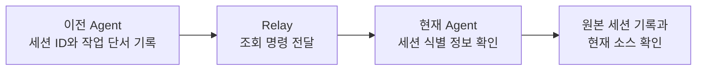

# Relay

**AI Agent 세션을 기록하고, 다음 Agent가 이전 작업을 찾아갈 수 있게 연결하는 로컬 CLI입니다.**

Codex로 작업하다 Claude Code나 Grok으로 옮기거나 새 대화를 열면, 새 Agent는 어떤 세션에서 무슨 일을 했는지부터 찾아야 합니다. Relay는 실제 세션 ID, 도구, 프로젝트 경로, 짧은 작업 요약을 로컬 SQLite에 기록해 그 출발점을 제공합니다.



Relay는 찾을 단서만 전달하고, 내용 파악은 Agent가 합니다. 전체 대화 보관, 원본 로그 수집, 실행 중인 Agent 전환, 대화 자동 재개는 제공하지 않습니다.

## 목차

- [주요 기능](#주요-기능)
- [설치](#설치)
- [빠른 시작](#빠른-시작)
- [명령](#명령)
- [세션 기록과 연결](#세션-기록과-연결)
- [Agent 연동](#agent-연동)
- [터미널과 브라우저 화면](#터미널과-브라우저-화면)
- [데이터와 설정](#데이터와-설정)
- [문제 해결](#문제-해결)
- [API](#api)
- [개발](#개발)

## 주요 기능

- **자동 첫 기록**: Claude Code, Codex, Grok의 SessionStart 훅이 세션 시작 시 식별 정보를 기록합니다.
- **조회**: 출처별 최근 세션, 프로젝트별 조회, 이름·ID·요약·경로 부분 검색을 지원합니다.
- **세션 연결**: `continue`로 이전 세션과 현재 세션의 부모·자식 관계를 남깁니다.
- **터미널 선택 화면**: 표에서 행을 고르면 상세를 확인하고, 다음 대화에 붙여넣을 조회 명령을 복사합니다.
- **브라우저 조회**: 필터, 상세, 요약 이력, 세션 연결을 `127.0.0.1`에서 확인합니다.
- **30일 보관**: 마지막 갱신 기준 30일이 지난 기록은 자동 정리됩니다.

## 설치

Windows 10/11 x64를 지원합니다. 실행 파일에 런타임과 웹 자산이 포함되므로 설치 후에는 Node.js, Bun, 관리자 권한이 필요 없습니다.

### 빌드하고 설치하기

소스에서 빌드하려면 Node.js 22.12 이상과 npm이 필요합니다.

```powershell
npm ci
npm run build
.\scripts\install-cli.ps1
```

설치 스크립트는 `dist\relay.exe`를 `%USERPROFILE%\.local\bin\relay.exe`에 복사하고, 그 폴더를 사용자 PATH에 추가한 뒤 `relay install-hooks`로 SessionStart 훅을 등록합니다. 이미 빌드된 실행 파일이 있다면 설치 스크립트만 실행하면 됩니다.

```powershell
relay --version
relay --help
```

`relay`를 찾지 못하면 새 터미널을 여세요. Codex는 등록된 훅을 `/hooks`에서 한 번 신뢰해야 실행됩니다.

### 업데이트와 제거

실행 중인 `relay web` 서버가 있으면 먼저 종료한 뒤 다시 빌드하고 덮어씁니다.

```powershell
npm run build
.\scripts\install-cli.ps1 -Force
```

설치 위치는 `-InstallDirectory <절대경로>`, PATH 등록 생략은 `-NoPath`로 지정합니다. 제거하려면 설치된 `relay.exe`를 삭제하고, 데이터까지 지우려면 [저장소 폴더](#데이터와-설정)를 확인한 뒤 삭제합니다.

## 빠른 시작

### 현재 Agent에게 이전 세션 찾기 요청

Codex에서 이렇게 요청합니다.

> Relay로 직전 Grok 세션을 찾아서 어떤 작업을 했는지 파악해 주세요.

Agent는 다음 명령으로 출발합니다. 여기서 `grok`은 **찾아볼 이전 작업의 출처**이며 현재 Agent를 바꾸는 옵션이 아닙니다.

```powershell
relay latest grok --json
relay latest grok --cwd "C:\workspace\my-project" --json
```

조회 결과에서 Agent가 보는 단서는 다음과 같습니다.


| 필드                        | 의미                                 |
| ------------------------- | ---------------------------------- |
| `provider` / `agent`      | 어떤 제공자와 도구의 세션인지                   |
| `providerSessionId`       | 원본 세션을 찾을 때 쓰는 실제 Agent Session ID |
| `workingDirectory`        | 어느 프로젝트에서 한 작업인지                   |
| `sessionName` / `summary` | 어떤 작업을 하던 세션인지                     |
| `createdAt` / `updatedAt` | Relay에 처음 기록하고 마지막으로 갱신한 시각        |


### 직접 골라서 다음 대화에 붙여넣기

```powershell
relay --grok
```

표에서 세션을 클릭하거나 `Enter`를 누르면 브라우저와 같은 상세(최근 작업 요약, 세션 정보, 기록 이력, 세션 연결)가 열립니다. 상세에서 한 번 더 클릭하거나 `Enter`를 누르면 아래 한 줄이 복사됩니다. 새 대화에 붙여넣으면 현재 Agent가 그 명령으로 세션 단서를 확인합니다.

```text
이전 세션 맥락은 `relay show '<Agent Session ID>' --provider '<provider>' --data-dir '<Relay 저장소>' --json` 명령을 실행해 확인하고, 그 기록을 참고해 다음 작업에 참고 해주세요.
```

받는 Agent는 같은 PC에서 `relay`와 해당 저장소에 접근할 수 있어야 합니다. 이전 작업을 **파악하는 요청**과 **이어서 수행하는 요청**은 구분하세요. 작업을 재개하려면 "이 기록을 확인하고 작업을 이어서 해 주세요"처럼 요청하고, Agent는 `relay continue`로 세션의 출처를 연결합니다.

## 명령


| 명령                                                          | 용도                      |
| ----------------------------------------------------------- | ----------------------- |
| `relay --codex` / `--claude` / `--grok`                     | 해당 출처의 최근 기록을 고르는 단축 조회 |
| `relay latest <별칭> [--cwd <경로>]`             | 출처의 최근 갱신 기록 한 건        |
| `relay list [--query <텍스트>] [--provider] [--agent] [--cwd]` | 세션 목록과 부분 검색            |
| `relay show <Agent Session ID> [--provider] [--history]`    | 세션 상세와 요약 이력            |
| `relay record`                                              | 현재 세션 첫 기록              |
| `relay update --session-id <ID> --summary <요약>`             | 진행 요약 갱신                |
| `relay continue <이전 ID> --parent-provider <제공자> ...`        | 이전 세션에 현재 세션 연결         |
| `relay web [--open] [--port <번호>]`                          | 브라우저 조회 서버 실행           |
| `relay install-hooks`                                       | SessionStart 훅 등록       |


Agent나 스크립트에서는 `--json`을 붙이세요. 성공 결과는 stdout, 실패는 stderr에 JSON 하나로 출력됩니다. 종료 코드는 `0` 성공, `2` 입력·설정 오류, `3` 기록 없음, `4` 충돌, `5` 저장소 오류, `6` 서버 시작 실패입니다.

### 조회 별칭


| 별칭       | provider    | agent         |
| -------- | ----------- | ------------- |
| `codex`  | `openai`    | `codex`       |
| `claude` | `anthropic` | `claude-code` |
| `grok`   | `xai`       | `grok`        |


"최근"의 기준은 Relay의 마지막 갱신 시각 `updatedAt`입니다. `latest`와 단축 조회는 기본적으로 모든 프로젝트를 대상으로 하며, `--cwd`를 주면 정확히 일치하는 경로의 기록만 찾습니다. 범위에 기록이 없으면 `SESSION_NOT_FOUND`를 반환하고 다른 프로젝트나 제공자로 자동 전환하지 않습니다.

### 두 종류의 ID


| 표시 이름            | JSON 필드             | 쓰임새                                       |
| ---------------- | ------------------- | ----------------------------------------- |
| Agent Session ID | `providerSessionId` | 원본 도구가 부여한 실제 세션 ID. CLI 조회와 원본 세션 탐색에 사용 |
| Relay 내부 ID      | `id`                | Relay 저장소 식별자. 웹 API와 부모·자식 연결에 사용        |


Agent Session ID는 Claude Code, Codex, Grok이 각자 발급하는 36자 UUID이며 Relay는 그 값을 그대로 저장합니다. 같은 ID가 여러 제공자에 있으면 `--provider`를 지정합니다. 내부 ID를 CLI에 잘못 입력하면 올바른 `relay show` 명령을 안내합니다.

## 세션 기록과 연결

기록의 핵심은 **원본 도구가 부여한 실제 세션 ID**입니다. Agent는 호스트가 제공한 값을 그대로 쓰고 임의로 만들지 않습니다. 요약은 다음 Agent가 작업을 식별할 만큼만 짧게 적습니다. 예를 들어 `로그인 리다이렉트 수정. auth/callback.ts 변경, 테스트 통과. 모바일 확인 필요.` 정도면 충분하며, 전체 채팅, 파일 전문, 비밀정보는 넣지 않습니다.

### 첫 기록과 갱신

Codex 환경의 PowerShell 예시입니다. 먼저 현재 세션의 기록이 있는지 확인하고, 없을 때만 첫 기록을 만듭니다.

```powershell
relay show $env:CODEX_THREAD_ID --provider openai --json
relay record --provider openai --agent codex --session-id $env:CODEX_THREAD_ID --session-name "로그인 리다이렉트 수정" --summary "로그인 콜백의 리다이렉트 동작 확인 중"
```

기록이 이미 있거나 작업 단위가 끝났으면 요약을 갱신합니다. 시작 훅이 먼저 기록한 경우에도 `update`를 씁니다.

```powershell
relay update --session-id $env:CODEX_THREAD_ID --provider openai --summary "auth/callback.ts 수정, 테스트 통과. 모바일 확인 필요"
```

`record`는 같은 첫 입력을 재시도해도 이력을 중복 생성하지 않지만, `update`는 호출마다 이력을 추가합니다. `--cwd`를 생략하면 현재 작업 디렉터리를 저장합니다.

### 이전 세션 이어받기

Grok 세션을 확인한 Codex가 작업을 이어받는 예시입니다. `--parent-provider`는 이전 세션의 제공자, `--provider`는 현재 세션의 제공자입니다.

```powershell
relay continue '<이전 Agent Session ID>' --parent-provider xai --provider openai --agent codex --session-id $env:CODEX_THREAD_ID --summary "이전 로그인 수정 세션을 확인함. 모바일 동작 검증 진행"
```

- `continue`는 Relay 기록 사이의 부모 연결만 남기며 원본 대화를 재개하지 않습니다.
- 작업을 이어받을 때는 별도로 `record`하지 말고 `continue`를 먼저 호출합니다. 훅이 현재 세션을 이미 기록해 두었어도 부모가 없으면 연결됩니다.
- 새 기록은 부모의 작업명과 프로젝트 경로를 기본으로 씁니다. 다른 폴더에서 이어받으면 `--cwd`를 지정하세요.
- 이미 다른 부모에 연결돼 있거나 자기 자신·자손을 부모로 지정하면 `PARENT_CONFLICT`입니다.

## Agent 연동

### 스킬 설치

[skills/relay-session](skills/relay-session/SKILL.md)은 Agent가 Relay를 기록·조회하는 절차를 담은 스킬입니다. 프로젝트 단위로 설치하며, 기존 파일 내용이 다르면 덮어쓰지 않고 중단합니다.

```powershell
.\scripts\install-skill.ps1 -Agent codex -ProjectDirectory "C:\workspace\my-project"
.\scripts\install-skill.ps1 -Agent claude -ProjectDirectory "C:\workspace\my-project"
```

각각 `.agents/skills/relay-session`, `.claude/skills/relay-session`에 배치합니다. 스킬을 인식한 Codex에서는 `$relay-session grok`으로 Grok 기록을 조회할 수 있습니다.

### 자동 기록 프롬프트 템플릿

프로젝트의 `AGENTS.md` 또는 `CLAUDE.md`에 아래 지침을 추가하면 Agent가 첫 작업 전에 기록 절차를 수행합니다.

```text
세션의 첫 작업 전에 relay-session 스킬을 읽고, 그 절차에 따라 현재 세션 정보를 Relay에 기록한다.
명령을 추측하지 않는다. 스킬을 찾지 못하면 relay --help로 확인한다.
호스트가 제공한 실제 세션 ID만 사용하고, 기존 기록을 먼저 확인해 없을 때만 생성한다.
이전 작업을 이어받으면 continue로 출처를 연결하고, 작업 단위가 끝나면 짧은 진행 단서를 갱신한다.
relay가 없거나 기록에 실패하면 한 줄로 알리고 원래 작업을 계속한다.
```

세션 ID는 호스트가 환경변수로 제공합니다. PowerShell에서는 `$env:CLAUDE_CODE_SESSION_ID`, `$env:CODEX_THREAD_ID`, `$env:GROK_SESSION_ID`입니다.

### 시작 훅

`relay install-hooks`가 세 도구의 SessionStart 훅을 등록하며, `relay.exe`를 실행할 때도 빠진 훅을 다시 채웁니다. 기존 훅은 유지하고 Relay 항목이 있으면 실행 파일 경로만 맞춥니다.


| 도구          | 훅 위치                        | 명령                      |
| ----------- | --------------------------- | ----------------------- |
| Claude Code | 사용자 설정 `hooks.SessionStart` | `relay.exe hook claude` |
| Codex       | `~/.codex/hooks.json`       | `relay-hook-codex.cmd`  |
| Grok        | `~/.grok/hooks/relay.json`  | `relay-hook-grok.cmd`   |


Claude Code 설정 예시입니다. Codex와 Grok은 같은 구조에 래퍼 `.cmd` 경로를 넣습니다.

```json
{
  "hooks": {
    "SessionStart": [
      { "hooks": [{ "type": "command", "command": "\"C:/Users/<사용자>/.local/bin/relay.exe\" hook claude || echo {}", "timeout": 10 }] }
    ]
  }
}
```

훅은 `{}`를 먼저 출력하고 기록 오류를 호스트 세션에 전파하지 않습니다. 세션 ID는 페이로드의 `session_id`, `sessionId`, `thread_id`와 환경변수 순으로 찾고, 작업 폴더 이름과 `세션 첫 기록 (훅 자동 기록)` 요약으로 등록합니다. 실제 작업 단서는 이후 Agent가 `update`로 남깁니다.

## 터미널과 브라우저 화면

### 터미널 표

`relay list`와 단축 조회는 아래 열을 표시합니다. 이름과 Agent Session ID는 항상 남고, 터미널이 좁으면 요약, 생성, 갱신, Agent, 프로젝트 순으로 숨깁니다.


| 열                | 내용                              |
| ---------------- | ------------------------------- |
| 이름               | 세션 이름. 훅이 기록한 세션은 프로젝트 폴더명      |
| 프로젝트             | 작업 경로의 폴더명                      |
| Agent            | 도구 이름. 제공자별로 색이 다름              |
| Agent Session ID | 원본 도구의 실제 세션 ID                 |
| 생성 · 갱신          | 로컬 시각을 `26.09.17 18:00` 형식으로 표시 |
| 요약               | 마지막 진행 요약                       |


터미널에서 직접 실행하면 행을 골라 상세를 보고 복사하는 선택 화면이 열립니다. 상세는 브라우저 상세와 같은 내용을 한 화면에 담습니다. 파일로 리디렉션하거나 Agent가 비대화형으로 호출하면 표 또는 JSON만 출력합니다.


| 조작                                                   | 동작                                          |
| ---------------------------------------------------- | ------------------------------------------- |
| 마우스 이동 · `↑` `↓` · `j` `k` · `PgUp` `PgDn` · `g` `G` | 목록에서 행 이동, 상세에서 스크롤                         |
| 클릭 · `Enter` · `Space`                               | 목록에서 선택한 세션의 상세 열기, 상세에서 조회 안내 한 줄을 복사하고 닫기 |
| `Backspace` · 상세에서 `Esc`                             | 상세에서 목록으로 돌아가기                              |
| `q` · `Ctrl+C` · 목록에서 `Esc`                          | 복사하지 않고 닫기                                  |


선택 화면은 `RELAY_NO_TUI=1`, 색상은 `NO_COLOR=1`로 끕니다. 글자 크기는 터미널 설정을 따릅니다. Windows 클립보드에서 한글이 깨지면 `RELAY_CLIPBOARD=powershell`을 지정하세요.

### 브라우저

```powershell
relay web --open
```

기본 주소는 `http://127.0.0.1:7474`이며 종료는 `Ctrl+C`입니다. 검색, 제공자·도구·프로젝트 경로 필터, 페이지 이동, 세션 상세를 제공하고, 상세의 **개요 / 기록 이력 / 세션 연결** 탭에서 작업 단서와 연결된 세션을 봅니다. 화면은 3초마다 갱신됩니다.

- **세션 컨텍스트 복사**: 다음 Agent에게 전달할 조회 명령과 안내 문구 한 줄
- **조회 명령 복사**: `relay show ... --json` 명령만
- **Agent Session ID만 복사**: 원본 도구의 실제 세션 ID만

## 데이터와 설정

저장소는 `--data-dir` → `RELAY_DATA_DIR` → 사용자 홈의 `.relay` 순으로 정합니다. 그 폴더에 `relay.db`와 선택 파일 `config.json`을 둡니다. Relay 저장소와 프로젝트 작업 디렉터리는 다른 경로이며, 기록과 조회에는 같은 저장소를 써야 합니다.

```powershell
relay latest grok --data-dir "C:\relay-data" --json
relay web --data-dir "C:\relay-data" --port 7475
```

```json
{
  "schemaVersion": 1,
  "webHost": "127.0.0.1",
  "webPort": 7474,
  "retentionDays": 30
}
```

DB는 로컬 디스크에 두세요. 네트워크 드라이브나 클라우드 동기화 폴더는 지원하지 않습니다.

### 보관 기간

기본 보관 기간은 **마지막 갱신으로부터 30일**입니다. 정리는 `record`, `continue`, `update` 같은 기록 명령에서만 수행하며, 자식이 참조하는 부모는 함께 보존합니다. `retentionDays`는 0~3650이고 `0`이면 자동 삭제를 끕니다. Relay 기록을 정리해도 프로젝트 소스나 원본 Agent의 세션 파일은 삭제하지 않습니다.

## 문제 해결


| 증상                  | 확인할 것                                                 |
| ------------------- | ----------------------------------------------------- |
| `relay`를 찾지 못함      | 새 터미널을 열거나 실행 파일의 절대경로를 사용                            |
| `SESSION_NOT_FOUND` | 출처, 조회 범위, 저장소 경로 확인. Relay에 없다는 뜻이지 원본 세션이 없다는 뜻은 아님 |
| 엉뚱한 프로젝트의 기록이 나옴    | 기본값은 전체 프로젝트. `latest <별칭> --cwd <절대경로>`로 제한          |
| 요약이 훅 기본 문구뿐임       | Agent가 작업 시작 후 `update`로 단서를 남겼는지 확인                  |
| 오래된 기록이 사라짐         | 30일 보관 정책. 원본 Agent 기록과 프로젝트 파일은 별개                   |
| 설치 시 파일이 사용 중       | 실행 중인 `relay web` 서버를 종료하고 다시 설치                      |
| 웹 포트가 사용 중          | `relay web --port 7475`처럼 다른 포트 지정                    |
| Codex 훅이 실행되지 않음    | Codex에서 `/hooks`로 Relay 항목을 신뢰                        |


## API

웹 서버는 로컬 조회 전용입니다. `127.0.0.1`에 바인딩하고 Host/Origin 검사와 CSP를 적용하며, 쓰기 API는 없습니다.


| 조회 API                              | 용도                                      |
| ----------------------------------- | --------------------------------------- |
| `GET /api/v1/health`                | 버전, 준비 상태, 저장소 경로                       |
| `GET /api/v1/sessions`              | 목록: `q/provider/agent/cwd/limit/offset` |
| `GET /api/v1/sessions/:id`          | 상세, 부모, 자식 첫 페이지                        |
| `GET /api/v1/sessions/:id/updates`  | 요약 이력                                   |
| `GET /api/v1/sessions/:id/children` | 자식 세션                                   |


`:id`는 Relay 내부 ID입니다. 응답은 `schemaVersion: 1`과 camelCase 필드를 쓰고, 페이지 크기는 기본 50, 최대 100입니다.

## 라이선스

[MIT](LICENSE)